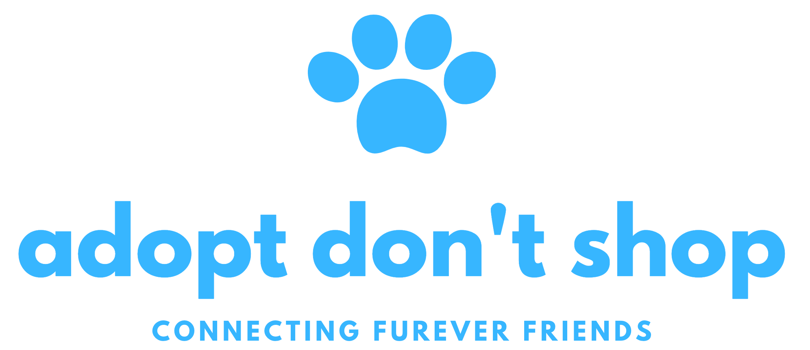

# Adopt Don't Shop Paired Project

### Adopt Don't Shop is a fictictious pet adoption app built on Rails. Users can favorite pets and apply to adopt these pets.



## Deployment

A deployment of the project is available here: [friends-furever](https://friends-furever.herokuapp.com/)

## Setup

### Prerequisites

- Ruby 2.5
- Rails 5.2.x

### Running Locally

```shell
git clone https://github.com/dcoleman21/adopt_dont_shop_paired # or clone your own fork
cd adopt_dont_shop_paired
bundle install
rails s
```

You should be able to access the app via [localhost:3000](http://localhost:3000/)

## Authors
- [Dani Coleman](https://github.com/dcoleman21)
- [Leah Riffell](https://github.com/leahriffell)
